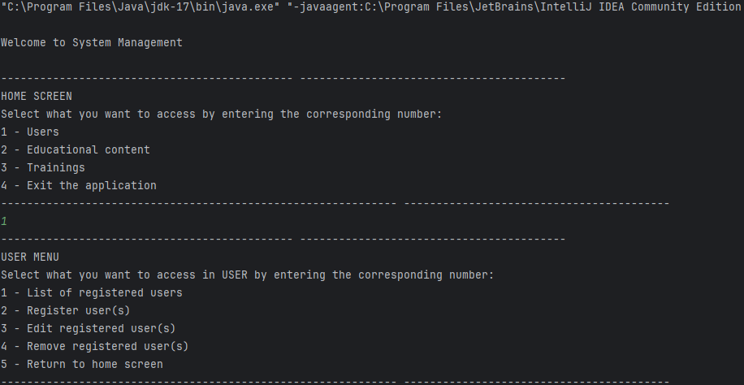
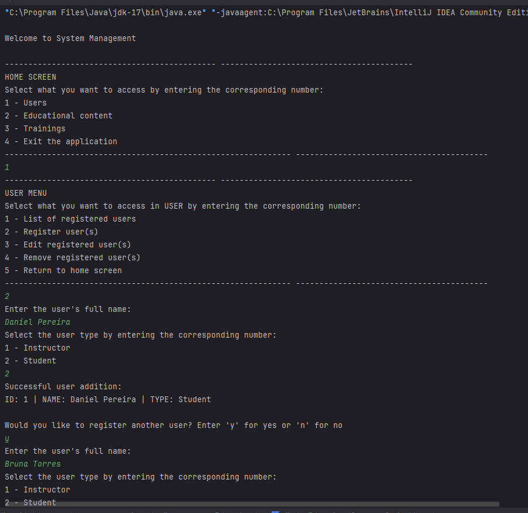
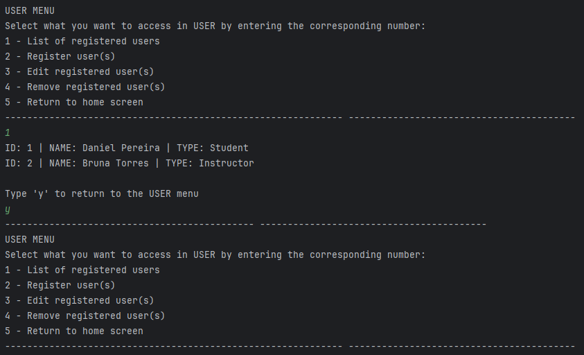

# Project Challenge: Lab Learn Kotlin with Examples

 
Repository for my abstraction for the project challenge "Abstracting Using Object Orientation with Kotlin"!!

 

## Technologies used
###
* **Language:** Kotlin
* **Versioning:** Git/GitHub
* **IDE:** IntelliJ IDEA Community Edition

 

## The project
###
* This is an application for simulating a registration system.
* The build system presents users, training, educational content, user types, types of educational content and difficulty levels (applicable to training and educational content).
* Trainings may contain educational content and registered users.

 

## Some details about the application
###

* There is no database. Therefore, when the execution ends, all data (registered users, content, training, etc.) is lost;
- The simulation of a type of interface running on the console added to the connection built between all the functions allows for cyclical and continuous navigation between all these functions, storing and using the data during this execution time;
* Data from classes and various variables are not inserted prior to execution. All values are received by a keyboard input reading system and are therefore entered by the user;
- All reception of values per entry have their validations according to each case and need. Ex: validations to not receive numbers, validations to not receive null, validations to receive values from among offered options, etc.;
* There are also checks that provide feedback and options to the user. Ex: The user is going to register a user for training, but there are no employees registered in the system. You will be notified that there are no users registered in the system and given the option to register users in the system. Ex: The user is removing users in a formation. When there are no more users, a warning will be given and the application will direct you to the menu;
- Constructor overloading is used in classes for empty constructor calls and in some cases, default values (which can be changed) are determined for variables;
* There are loops that allow the user to perform operations repeatedly in an easier way. Ex: Remove more than one user from the same formation in sequence;

 

## Organization
###

At [src/main/kotlin](https://github.com/jessicaraissapessoa/desafio-projeto-aprenda-kotlin-com-exemplos-lab-bootcamp-santander-dio-2023/tree/main/src/main/kotlin ) are the application codes.
These codes are divided into packages (folders/directories). Below is a description of what each package encompasses:

| Package                                                                                                                                              | Description                                                                                                                                                          | Files                                                                                                                                                                                                                                                                                                                                                                                                                                                                                                                                                                                                                                                                                                                                                                                                                                                                                                                                                                                                                                                                                                                                                                                                                        |
|------------------------------------------------------------------------------------------------------------------------------------------------------|----------------------------------------------------------------------------------------------------------------------------------------------------------------------|------------------------------------------------------------------------------------------------------------------------------------------------------------------------------------------------------------------------------------------------------------------------------------------------------------------------------------------------------------------------------------------------------------------------------------------------------------------------------------------------------------------------------------------------------------------------------------------------------------------------------------------------------------------------------------------------------------------------------------------------------------------------------------------------------------------------------------------------------------------------------------------------------------------------------------------------------------------------------------------------------------------------------------------------------------------------------------------------------------------------------------------------------------------------------------------------------------------------------|
| [src/main/kotlin/application](https://github.com/daniellimadev/learn-kotlin-with-lab-examples/tree/main/src/main/kotlin/application)                 | Folder contains the main (application initializer) and interface simulations (user navigation menus that connect and order all application executions)               | [Main.kt](https://github.com/daniellimadev/learn-kotlin-with-lab-examples/blob/main/src/main/kotlin/application/main.kt) [homeScreen.kt](https://github.com/daniellimadev/learn-kotlin-with-lab-examples/blob/main/src/main/kotlin/application/homeScreen.kt) [menuUser.kt](https://github.com/daniellimadev/learn-kotlin-with-lab-examples/blob/main/src/main/kotlin/application/menuUser.kt) [menuContentEducational.kt](https://github.com/daniellimadev/learn-kotlin-with-lab-examples/blob/main/src/main/kotlin/application/menuContentEducational.kt) [menuTraining.kt](https://github.com/daniellimadev/learn-kotlin-with-lab-examples/blob/main/src/main/kotlin/application/menuTraining.kt)                                                                                                                                                                                                                                                                                                                                                                                                                                                                                                         |
| [src/main/kotlin/enums](https://github.com/daniellimadev/learn-kotlin-with-lab-examples/tree/main/src/main/kotlin/enums)                             | Folder contains all application enums. Data type that stores sets of fixed values                                                                                    | [TypeUser.kt](https://github.com/daniellimadev/learn-kotlin-with-lab-examples/blob/main/src/main/kotlin/enums/TypeUser.kt)  [TypeEducationalContent.kt](https://github.com/daniellimadev/learn-kotlin-with-lab-examples/blob/main/src/main/kotlin/enums/TypeEducationalContent.kt) [LevelDifficulty.kt](https://github.com/daniellimadev/learn-kotlin-with-lab-examples/blob/main/src/main/kotlin/enums/LevelDifficulty.kt)                                                                                                                                                                                                                                                                                                                                                                                                                                                                                                                                                                                                                                                                                                                                                                                      |
| [src/main/kotlin/user](https://github.com/daniellimadev/learn-kotlin-with-lab-examples/tree/main/src/main/kotlin/user)                               | Folder contains user-related class and functions. Adding, editing and removing users in the system                                                                   | [User.kt](https://github.com/daniellimadev/learn-kotlin-with-lab-examples/blob/main/src/main/kotlin/user/User.kt) [listUsers.kt](https://github.com/daniellimadev/learn-kotlin-with-lab-examples/blob/main/src/main/kotlin/user/listUsers.kt) [viewsUsers.kt](https://github.com/daniellimadev/learn-kotlin-with-lab-examples/blob/main/src/main/kotlin/user/viewsUsers.kt) [registerUser.kt](https://github.com/daniellimadev/learn-kotlin-with-lab-examples/blob/main/src/main/kotlin/user/registerUser.kt) [editUser.kt](https://github.com/daniellimadev/learn-kotlin-with-lab-examples/blob/main/src/main/kotlin/user/editUser.kt) [removalUser.kt](https://github.com/daniellimadev/learn-kotlin-with-lab-examples/blob/main/src/main/kotlin/user/removalUser.kt)                                                                                                                                                                                                                                                                                                                                                                                                                              |
| [src/main/kotlin/contentEducational](https://github.com/daniellimadev/learn-kotlin-with-lab-examples/tree/main/src/main/kotlin/contentEducational)   | Folder contains class and functions related to educational content. Adding, editing and removing educational content in the system                                   | [ContentEducational.kt](https://github.com/daniellimadev/learn-kotlin-with-lab-examples/blob/main/src/main/kotlin/contentEducational/ContentEducational.kt) [listEducationalContents.kt](https://github.com/daniellimadev/learn-kotlin-with-lab-examples/blob/main/src/main/kotlin/contentEducational/listEducationalContents.kt) [displayEducationalContentsOptionMenu.kt](https://github.com/daniellimadev/learn-kotlin-with-lab-examples/blob/main/src/main/kotlin/contentEducational/displayEducationalContentsOptionMenu.kt) [registerEducationalContent.kt](https://github.com/daniellimadev/learn-kotlin-with-lab-examples/blob/main/src/main/kotlin/contentEducational/registerEducationalContent.kt) [editEducationalContent](https://github.com/daniellimadev/learn-kotlin-with-lab-examples/blob/main/src/main/kotlin/contentEducational/editEducationalContent.kt) [deleteEducationalContent](https://github.com/daniellimadev/learn-kotlin-with-lab-examples/blob/main/src/main/kotlin/contentEducational/deleteEducationalContent.kt)                                                                                                                                                   |
| [src/main/kotlin/training](https://github.com/daniellimadev/learn-kotlin-with-lab-examples/tree/main/src/main/kotlin/training)                       | Folder contains class and functions related to educational training. Adding, editing and removing trainings, users in trainings and educational content in trainings | [Training.kt](https://github.com/daniellimadev/learn-kotlin-with-lab-examples/blob/main/src/main/kotlin/training/Training.kt) [listTraining.kt](https://github.com/daniellimadev/learn-kotlin-with-lab-examples/blob/main/src/main/kotlin/training/listTraining.kt) [displayListTrainingsOptionMenu.kt](https://github.com/daniellimadev/learn-kotlin-with-lab-examples/blob/main/src/main/kotlin/training/displayListTrainingsOptionMenu.kt) [registerTraining.kt](https://github.com/daniellimadev/learn-kotlin-with-lab-examples/blob/main/src/main/kotlin/training/registerTraining.kt) [editDataTraining.kt](https://github.com/daniellimadev/learn-kotlin-with-lab-examples/blob/main/src/main/kotlin/training/editDataTraining.kt) [excludeTraining.kt](https://github.com/daniellimadev/learn-kotlin-with-lab-examples/blob/main/src/main/kotlin/training/excludeTraining.kt) [editUsersTraining.kt](https://github.com/daniellimadev/learn-kotlin-with-lab-examples/blob/main/src/main/kotlin/training/editUsersTraining.kt) [editContentsTraining.kt](https://github.com/daniellimadev/learn-kotlin-with-lab-examples/blob/main/src/main/kotlin/training/editContentsTraining.kt)  |

 

## Demo screenshots
###

### Navigation between menus and termination of execution:

 

**Part of Home screen:**

 

**Part of user of creation:**

 

**Part of list of User:**

 